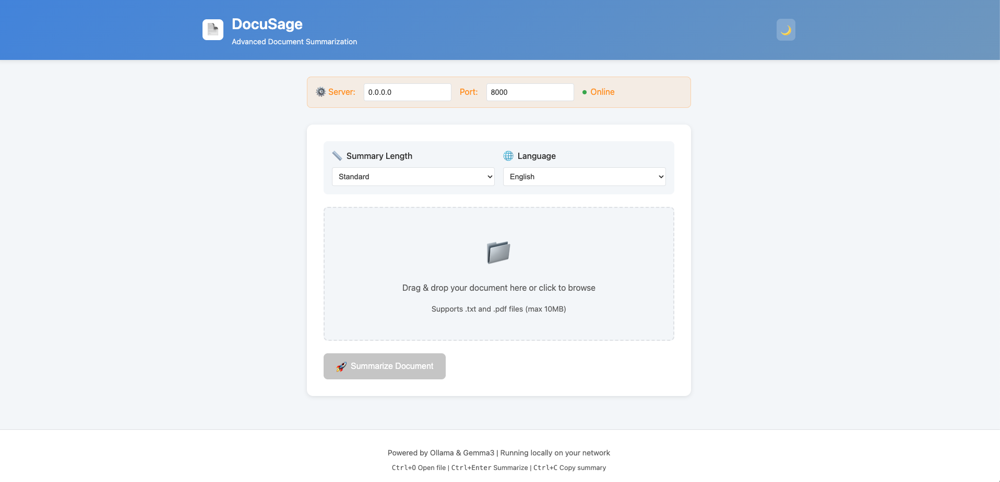

# DocuSage 🔮

<p align="center">
  
  
  
  
</p>

<p align="center">
  <b>Transform documents into intelligent summaries using local AI</b><br>
  Private • Fast • Multi-language • Network-ready
</p>

---

## ✨ What is DocuSage?

DocuSage is a powerful document summarization system that runs entirely on your local network. Built for Apple Silicon Macs, it uses Ollama and advanced language models to create intelligent summaries in multiple languages, all while keeping your data completely private.

### 🎯 Perfect for:
- 📚 Researchers processing academic papers
- 💼 Professionals handling business documents  
- 🏠 Home users organizing personal files
- 🏢 Teams needing shared document processing

## 🚀 Quick Start

```bash
# 1. Clone and setup
git clone https://github.com/Harshil7875/DocuSage.git
cd DocuSage

# 2. Install dependencies
conda create -n docusage python=3.10 -y
conda activate docusage
brew install ollama
ollama pull gemma3:12b-it-q4_K_M

# 3. Start services
ollama serve                              # Terminal 1
uvicorn server:app --host 0.0.0.0 --port 8000  # Terminal 2

# 4. Access DocuSage
# Open browser: http://localhost:8000
```

## 🌟 Key Features

### 📄 Document Processing
- **Multiple formats**: PDF, TXT (up to 10MB)
- **Batch processing**: Handle entire directories
- **Smart extraction**: Intelligent text parsing

### 🌐 Multi-language Support
- 🇺🇸 English
- 🇪🇸 Spanish (Español)
- 🇫🇷 French (Français)
- 🇩🇪 German (Deutsch)
- 🇯🇵 Japanese (日本語)
- 🇨🇳 Chinese (中文)

### 🎨 User Interfaces
- **Modern Web UI**: Drag-drop, dark mode, real-time status
- **Powerful CLI**: Automation-ready with multiple output formats
- **Network Access**: Use from any device on your LAN

### 🔒 Privacy First
- **100% local processing**: No cloud dependencies
- **Network isolation**: Runs on your private network
- **Data security**: Your documents never leave your machine

## 📋 System Requirements

| Component | Requirement |
|-----------|-------------|
| **OS** | macOS with Apple Silicon (M1/M2/M3/M4 Max) |
| **RAM** | 36GB minimum |
| **Storage** | 100GB free space |
| **Python** | 3.10 or higher |
| **Network** | Local LAN for multi-device access |

## 🛠️ Installation

<details>
<summary><b>1. Set up Python Environment</b></summary>

```bash
# Using Conda (recommended)
conda create -n docusage python=3.10 -y
conda activate docusage

# Or using venv
python -m venv docusage-env
source docusage-env/bin/activate  # On macOS/Linux
```
</details>

<details>
<summary><b>2. Install Ollama</b></summary>

```bash
# Install Ollama
brew install ollama

# Pull the language model
ollama pull gemma3:12b-it-q4_K_M

# Verify installation
ollama list
```
</details>

<details>
<summary><b>3. Install DocuSage</b></summary>

```bash
# Clone repository
git clone https://github.com/Harshil7875/DocuSage.git
cd DocuSage

# Install server dependencies
cd server
pip install -r requirements.txt

# Install client dependencies
cd ../client
pip install requests argparse
```
</details>

## 🖥️ Usage Guide

### Starting the Server

```bash
# Terminal 1: Start Ollama
ollama serve

# Terminal 2: Start DocuSage server
cd DocuSage/server
uvicorn server:app --host 0.0.0.0 --port 8000
```

### Web Interface

1. **Access**: Open `http://localhost:8000` in your browser
2. **Upload**: Drag and drop your document
3. **Configure**: Select language and summary length
4. **Process**: Click "Summarize Document"

<p align="center">
  
</p>

### Command Line Interface

```bash
# Basic usage
python client.py localhost document.pdf

# Advanced options
python client.py 192.168.1.17 report.pdf \
  --length brief \
  --language es \
  --output json

# Batch processing
python batch_processor.py localhost /documents \
  --extensions .pdf .txt \
  --output ./summaries
```

### Network Access

To use DocuSage from other devices on your network:

1. **Find your Mac's IP**:
   ```bash
   ifconfig | grep "inet " | grep -v 127.0.0.1
   ```

2. **Access from other devices**:
   - Web UI: `http://YOUR_MAC_IP:8000`
   - API: `http://YOUR_MAC_IP:8000/docs`

## 🏗️ Architecture

```
DocuSage/
├── 🖥️ server/
│   ├── server.py          # FastAPI backend
│   ├── requirements.txt   # Server dependencies
│   └── documents/         # Temporary storage
│
├── 💻 client/
│   ├── client.py          # CLI tool
│   ├── batch_processor.py # Batch operations
│   └── sample_docs/       # Example files
│
├── 🌐 web/
│   └── index.html         # Web interface
│
└── 📚 docs/
    └── ...                # Documentation
```

## 🔧 Configuration

### Server Settings

```python
# Environment variables
OLLAMA_URL="http://localhost:11434/api/generate"
OLLAMA_MODEL="gemma3:12b-it-q4_K_M"
MAX_FILE_SIZE="10485760"  # 10MB
```

### Summary Options

| Length | Description | Use Case |
|--------|-------------|----------|
| `brief` | 2-3 sentences | Quick overview |
| `standard` | Comprehensive summary | General use |
| `detailed` | In-depth with key points | Research/analysis |

## 🚨 Troubleshooting

<details>
<summary><b>Server won't start</b></summary>

- Check if Ollama is running: `ollama serve`
- Verify port 8000 is free: `lsof -i :8000`
- Ensure correct Python environment is activated
</details>

<details>
<summary><b>Can't access from other devices</b></summary>

- Use `--host 0.0.0.0` when starting server
- Check firewall settings
- Verify devices are on same network
- Use IP address, not localhost
</details>

<details>
<summary><b>Processing times out</b></summary>

- Increase file size limits in server.py
- Check Ollama model is loaded: `ollama list`
- Monitor system resources during processing
</details>

## 🤝 Contributing

We welcome contributions! Here's how to get started:

1. Fork the repository
2. Create a feature branch: `git checkout -b feature-name`
3. Make your changes
4. Run tests: `pytest tests/`
5. Submit a pull request

### Development Setup

```bash
# Install dev dependencies
pip install -r requirements-dev.txt

# Run tests
pytest

# Format code
black .
```

## 📚 Documentation

- [API Reference](docs/api-reference.md)
- [User Guide](docs/user-guide.md)
- [Developer Guide](docs/developer-guide.md)

## 🙏 Acknowledgments

- [Ollama](https://ollama.ai/) for local LLM inference
- [FastAPI](https://fastapi.tiangolo.com/) for the backend framework
- [PyMuPDF](https://pymupdf.readthedocs.io/) for PDF processing
- The open-source community

## 📄 License

This project is licensed under the MIT License - see the [LICENSE](LICENSE) file for details.

---